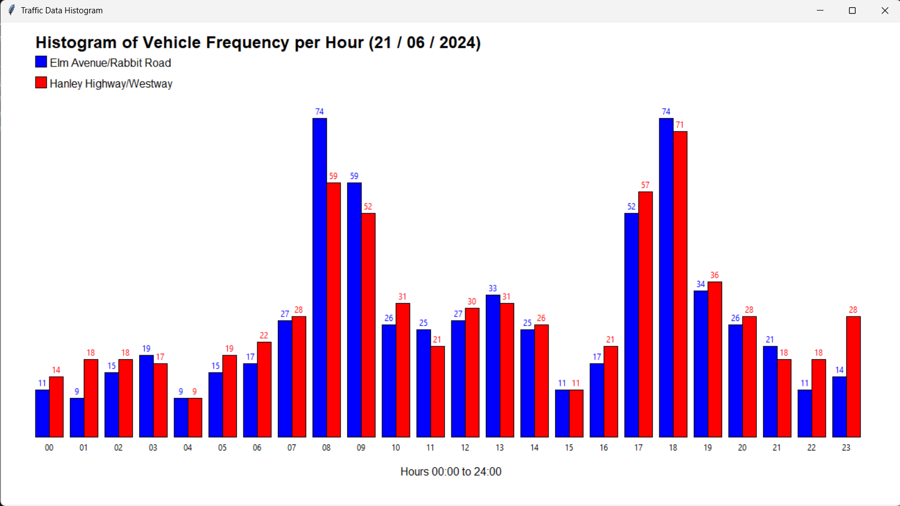

# Traffic Data Analyzer & Visualizer 🚦



A Python desktop application that reads traffic junction CSV data, computes key traffic metrics, and renders a live dual-bar histogram — built entirely with Python's standard library.

---

## Overview

This tool was built to process real-world traffic survey data collected at two junctions:
- **Elm Avenue/Rabbit Road**
- **Hanley Highway/Westway**

Given a survey date, the application locates the matching CSV file, calculates a comprehensive set of traffic statistics, saves the results to a log file, and displays an interactive histogram showing hourly vehicle frequency at both junctions side by side.

---

## Features

- **Date Validation** — Accepts day/month/year input with full validation: leap year detection, month-length rules, and range checks.
- **Traffic Metrics** — Computes 15+ insights from raw CSV data including:
  - Total vehicles, trucks, electric/hybrid vehicles, and two-wheelers
  - Buses leaving Elm Avenue heading North
  - Vehicles that didn't turn at junctions
  - Speed limit violations
  - Average bikes per hour
  - Scooter percentage at Elm Avenue
  - Peak traffic hour at Hanley Highway
  - Total hours of rainfall
- **Results Logging** — Appends processed outcomes to `results.txt` for record-keeping across sessions.
- **Live Histogram** — Renders a color-coded dual-bar histogram using Tkinter Canvas, with per-hour vehicle counts labeled on each bar.
- **Batch Processing** — Prompts the user to process additional datasets without restarting, clearing previous data between runs.

---

## Technologies Used

| Tool | Purpose |
|---|---|
| Python 3 | Core language |
| Tkinter | GUI window and canvas-based histogram |
| csv | CSV file parsing |
| collections.Counter | Hour-based traffic frequency counting |
| datetime | Current year detection for input validation |
| os | File path resolution |

---

## Getting Started

### Prerequisites

- Python 3.x (Tkinter is included in the standard library — no extra installs needed)

### Installation

1. Clone the repository:
```bash
   git clone https://github.com/Arani66/Traffic-Data-Analyzer.git
```

2. Navigate into the project folder:
```bash
   cd Traffic-Data-Analyzer
```

### Usage

1. Run the application:
```bash
   python traffic_analyzer.py
```

2. Enter the survey date when prompted (day, month, year separately).

3. The app will look for a CSV file named in the format:
```
   traffic_dataDDMMYYYY.csv
```
   For example, for 15 March 2024: `traffic_data15032024.csv`

4. If the file is found, the app will:
   - Print all traffic metrics to the console
   - Append results to `results.txt`
   - Open a Tkinter histogram window

5. After closing the histogram, you'll be asked if you want to process another dataset.

---

## Project Structure
```
Traffic-Data-Analyzer/
├── traffic_analyzer.py      # Entry point — runs the full pipeline
├── results.txt              # Auto-generated output log (appended each run)
├── histogram-preview.png    # Preview image for README
└── traffic_dataDDMMYYYY.csv # Input data files (named by survey date)
```

---

## How It Works
```
User inputs date
      ↓
Locates matching CSV file
      ↓
Processes traffic data → prints + saves metrics
      ↓
Loads hourly junction data
      ↓
Renders Tkinter histogram
      ↓
Prompts for another dataset or exits
```

---

## Notes

- If the CSV file for the entered date is not found, the app will notify the user and skip processing/histogram rendering.
- Results are **appended** (not overwritten) to `results.txt`, so data from multiple runs is preserved.
- The histogram scales bar heights relative to the peak hour count, so all data is always visible regardless of volume.

---

## Author

**Arani** — built as part of a data processing and visualization project.